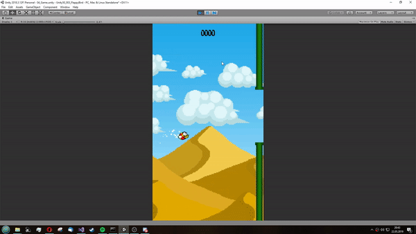

#Flappy Bird Project
## Game Devs der Gesamtschule Salzkotten
##### Inhaltsverzeichnis
[Zielsetzung](#zielsetzung)   
[Bilder](#bilder)   
[Für dev's](#devstuff)   
[Copyright Infos](#copyright)   

<a name="zielsetzung">

### Zielsetzung
Entwicklung eines voll funktionsfähigen Clones des Spieles 'Flappy Bird' durch Entwicklung von 'Wegwerf'-Prototypen zur Erlangung von Domänenwissen. Diese erworbene Wissen wird dann in der Entwicklung des fertigen Spiels umgesetzt.

<a name="bilder">

### Bilder
Hier sind ein paar Bilder vom (hoffentlich) aktuellsten Stand des Spiels:   

<a name="devstuff">

### Für dev's
#### Info: Das Event System benutzt int's als eine art ID. Hierfür verwenden wir die Funktion ``EventIdNorm.Hash(yourName, description)``
Hier ist eine Liste aller Events mit Person, Name und einer kurzen Beschreibung wann genau dieses Event getriggered wird   

| Person | Name           | Beschreibung (wann wird es getriggered?)     |
|--------|----------------|----------------------------------------------|
| Fynn   | onScored       | wenn der spieler einen punkt erzielt         |
| Jan    | hitTube        | wenn der spieler stirbt                      |
| Marius | showHighscores | wenn die highscore list aufgeruft wird [WIP] |
| nvp    | movePressed    | wenn der vogel sich bewegt (nach oben)       |
   
PlayerPref liste: (case sensitive!! die keys sind/werden mit upperCamelCase gespeichert)   

| Key          | Typ    | Beschreibung (was ist darin gespeichert?)         |
|--------------|--------|---------------------------------------------------|
| name         | string | Der Username (aus den settings)                   |
| soundVolume  | float  | Sound Effekt Lautstärke                           |
| musicVolume  | float  | Musik Lautstärke                                  |
| currentCcore | int    | Die aktuelle Punktzahl vom Spieler                |
| firstStart   | int    | Ist das der erste spiel start? (0 = ja, 1 = nein) |

<a name="copyright">

### Copyright Infos
Zur Zeit benuzten wir Assets von den folgenden Quellen:
- myinstants.com
